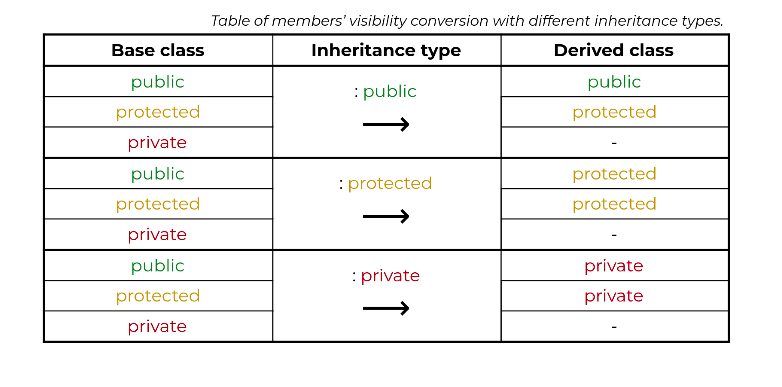

# Наследяване
## Inheritance vs. Composition
- И двете позволяват "преизползване" на съществуващ вече клас
- Наследяване:
  - `is-a` relationship:
    - `Employee` is-a `Person`
    - `Circle` is-a `Shape`
- Композиция:
  - `has-a` relationship:
    - `Person` has-a `BankAccount`
    - `Player` has-a `SpecialAttack`

## Access Specifiers


## Голяма петица
- **не се наследяват**, трябва да се **използват** в голямата четворка на наследника
- Ако не ги дефинираме в наследника, компилаторът ще ги създаде автоматично и ще вика съответния метод от родителя
- Ако ги дефинираме в наследника, трябва ние експлицитно да викаме и метода на родителя

```cpp
class Base {
private:
	char* base_str;

public:
	Base();
	Base(const char* str);
	Base(const Base& other);
	Base& operator=(const Base& other);
	~Base();

    Base(Base&& other);
    Base& operator=(Base&& other);

    void print() const;
    void print_newline() const;
};
```
```cpp
class Derived : public Base {
private:
	char* derived_str;

public:
	Derived();
	Derived(const char* base_str, const char* derived_str);
	Derived(const Derived& other);
	Derived& operator=(const Derived& rhs);
	~Derived();

    Derived(Derived&& other);
    Derived& operator=(Derived&& other);

    void print() const;
};
```

### Конструктори
- Родителят трябва да се инициализира преди наследника
- При създаването на обект от наследника, първо се изпълнява конструктора на родителя и чак след това на детето

```cpp
Base::Base() 
    : base_str(nullptr) 
{}

Base::Base(const char* str) 
{ 
    if(!str) base_str = nullptr;
    else{
        base_str = new char[strlen(str) + 1];
        strcpy_s(base_str, strlen(str) + 1, str);
    }
}

Base::Base(const Base& other)
    : Base(other.base_str)
{}
```

```cpp
Derived::Derived() 
    : Base(), // Ако не го викнем, понеже е дефолтния, се вика по подразбиране от компилатора
              // Ако няма дефолтен, експлицитно трябва някой друг да викнем
    derived_str(nullptr)
{}

Derived::Derived(const char* base_str, const char* derived_str) 
    : Base(base_str) // Трябва да викнем конструктор на Base, иначе ще се извика дефолтния - избираме си този с аргумент
{
    if(!derived_str) this->derived_str = nullptr;
    else{
        this->derived_str = new char[strlen(derived_str) + 1];
        strcpy_s( this->derived_str, strlen(derived_str) + 1, derived_str);
    }
} 

/*
    Не може:

    Derived::Derived(const Derived& other) 
        : Derived(other.base_str, other.derived_str)
    {}

    Derived::Derived(const Derived& other) 
        : Base(other), 
        Derived(other.derived_str) 
    {}
*/

Derived::Derived(const Derived& other) 
    : Base(other) // Трябва да викнем конструктор на Base, иначе ще се извика дефолтния - избираме копи конструктора 
{
    if(!other.derived_str) derived_str = nullptr;
    else{
        derived_str = new char[strlen(other.derived_str) + 1];
        strcpy_s(derived_str, strlen(other.derived_str) + 1, other.derived_str);
    }
}
```

### Деструктор
- Изпъляват се в обратен ред на конструкторите - първо на детето, после на родителя
- Всеки деструктор освобождава само ресурсите, които са заделени в съответстващия му конструктор

```cpp
Base::~Base() {
    delete[] base_str;
}
```
```cpp
Derived::~Derived() {
    delete[] derived_str;
}
```

### Оператор за присвояване
- Тук вече няма инициализиращ списък и се вика в тялото
- Операторът за присвояване на родителя, се грижи да се копира "родителската част" от обекта
```cpp
Base& Base::operator=(const Base& other) {
	if (this != &other) {
		if(!other.base_str) base_str = nullptr;
        else{
            base_str = new char[strlen(other.base_str) + 1];
            strcpy_s(base_str, strlen(other.base_str) + 1, other.base_str);
        }
	}
	return *this;
}
```
```cpp
Derived& Derived::operator=(const Derived& other) {
	if (this != &other) {

        Base::operator=(other); // Трябва експлицитно да викнем оператор= на родителя

		if(!other.derived_str) derived_str = nullptr;
        else{
            derived_str = new char[strlen(other.derived_str) + 1];
            strcpy_s(derived_str, strlen(other.derived_str) + 1, other.derived_str);
        }
	}
	return *this;
}
```
### move семантики
```cpp
Base::Base(Base&& other) {
    base_str = other.base_str;
    other.base_str = nullptr;
}

Base& Base::operator=(Base&& other) {
    if(this != &other) {
        delete[] base_str;
        base_str = other.base_str;
        other.base_str = nullptr;
    }
    return *this;
}
```
```cpp

Derived::Derived(Derived&& other) 
    : Base(std::move(other)) 
{
    derived_str = other.derived_str;
    other.derived_str = nullptr;
}

Derived& Derived::operator=(Derived&& other) {
    if(this != &other) {
        Base::operator=(std::move(other));

        delete[] derived_str;
        derived_str = other.derived_str;
        other.derived_str = nullptr;
    }
    return *this;
}
```

## friend и оператори
- Не се наследяват предефинираните оператори на родителя
- Не се наследяват приятелските функции на родителя

## Предефиниране на методи на родителя
- Наследник може директно да вика методи на родителя 
- Наследник може да предефинира методи на родителя

```cpp
void Base::print() const {
    std::cout << "Base: " << base_str;
}

void Base::print_newline() const {
    std::cout << std::endl;
}
```
```cpp
void Derived::print() const {
    Base::print(); // Ако е предефиниран, трябва да кажем print-а на чий клас искаме да използваме
    print_newline(); // Ако не е предефиниран, можем да си го викаме дикректно
    std::cout << "Derived: " << derived_str;
}
```

### Static Binding 
- Компилаторът определя кой метод се вика, според това, което вижда по време на компилация, а не това, което седи отдолу в паметта

```cpp
Base b("Hello"); 
b.print(); // Вика Base::print() -> "Base: Hello"

Derived d("Hello", "World");
d.print(); // Вика Derived::print() -> "Base: Hello
           //                           Derived: World"

d.Base::print(); // Вика Base::print() -> "Base: Hello"

// Засега няма да правим указатели Base*, които сочат към Derived обект, защото ще има теч на памет
Base* ptr = new Derived("Hello", "World");
ptr->print();   // Понеже ptr е от тип Base*, компилаторът ще извика Base::print()
                // По-нататък ще видим dynamic binding (методът се определя по време на изпълнение) и как това ще ни върши работа
```

# Задачи за упражнение
## Task 1
Да се напишат класовете:
- `Animal`, който съдържа име (`char*`) и възраст (`unsigned`)
- `Pet`, който наследява `Animal` и има име на стопанин (`char*`) и телефон на стопанин (`unsigned`) <= 99 999 999 *(ако номерът започва с 0, например: 0895xxxxxx, пишем само 895xxxxxx)*
- `WildAnimal`, който наследява `Animal` и има континент (`enum`) _(Ако не знаете какво е enum, пишете го char*)_

Да се реализират следните функционалности:
- Принтиране в конзолата на информацията за `Pet` и за `WildAnimal`
- Смяна на името на дадено животно
- Смяна на стопанина на даден домашен любимец

## Task 2
Да се напишат класовете:
- `Person`, който има име и възраст
- `Employee`, който наследява `Person` и има заплата
- `Company`, който има масив от работници.

Да се реализират следните фунцкионалности:
- Принтиране в конзолата на информацията за всеки работник във фирмата
- При подадено име на работник, да се проверява дали работи във фирмата
- При подадено име на работник, да се извеждат неговите възраст и заплата