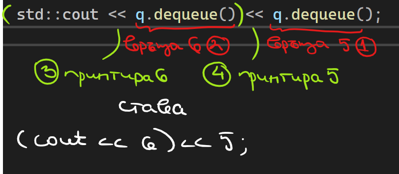

Ако сме си написали `dequeue` така, че да връща махнатия елемент и имаме следния `main`:
```c++
int main() {
	Queue<int> q;
	q.enqueue(5);
	q.enqueue(6);
	q.enqueue(1);

	std::cout << q.dequeue() << q.dequeue();
}
```
Редът на изпълнение на операциите е следния:


Ето и какви инструкции се генерират за този ред: 
```c++
// std::cout << q.dequeue() << q.dequeue();
00007FF7F8F711DE  mov         rsi,qword ptr [rdi+8]  // rsi = first->next
00007FF7F8F711E2  mov         ebp,dword ptr [rdi]   // ebp = first->data (т.е. 5)
00007FF7F8F711E4  mov         edx,10h  // edx = първи аргумент на delete - колко памет да изтрие
00007FF7F8F711E9  mov         rcx,rdi  // rcx = втори аргумент на delete - ня кой адрес да трие (адреса на first)
00007FF7F8F711EC  call        operator delete (07FF7F8F713CCh)  // трие first
00007FF7F8F711F1  mov         qword ptr [q],rsi  // first = rsi, което беше next-a на предния first
// --- край на първото dequeue

00007FF7F8F711F6  test        rsi,rsi  
00007FF7F8F711F9  je          main+133h (07FF7F8F71273h)  
00007FF7F8F711FB  mov         rdi,qword ptr [rsi+8]  // rdi = first -> next
00007FF7F8F711FF  mov         ebx,dword ptr [rsi]  // ebx = first -> next (т.е. 6)
00007FF7F8F71201  mov         edx,10h  // edx = size to deallocate
00007FF7F8F71206  mov         rcx,rsi  // rcx = address of first
00007FF7F8F71209  call        operator delete (07FF7F8F713CCh)  // deletes first
00007FF7F8F7120E  mov         qword ptr [q],rdi  // first = rdi, което беше next-a на предния first
// --- край на второто dequeue

00007FF7F8F71213  mov         edx,ebx  // edx = ebx, което е 6 
00007FF7F8F71215  mov         rcx,qword ptr [__imp_std::cout (07FF7F8F73080h)]  
00007FF7F8F7121C  call        qword ptr [__imp_std::basic_ostream<char,std::char_traits<char> >::operator<< (07FF7F8F73088h)]  // вика се operator<< с аргумента в edx (т.е. 6)
00007FF7F8F71222  mov         rcx,rax  
00007FF7F8F71225  mov         edx,ebp  // edx = ebp, което е 5
00007FF7F8F71227  call        qword ptr [__imp_std::basic_ostream<char,std::char_traits<char> >::operator<< (07FF7F8F73088h)]  // вика се operator<< с аргумента в edx (т.е. 5)
00007FF7F8F7122D  nop  
```